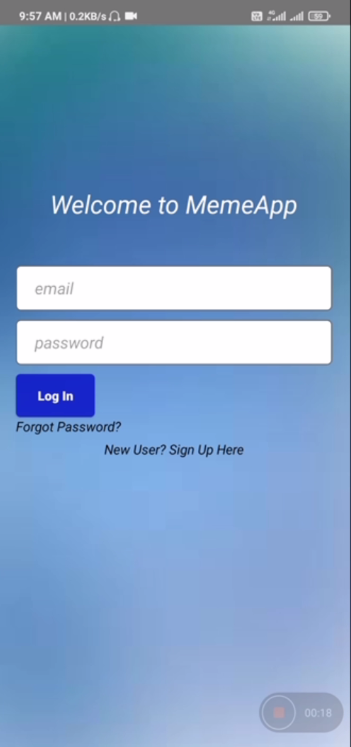
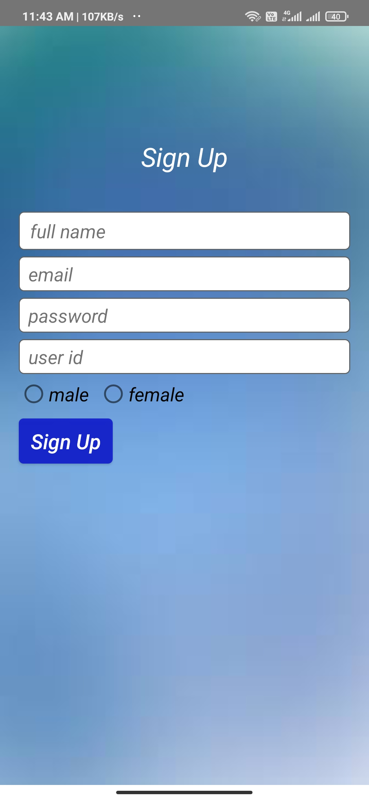
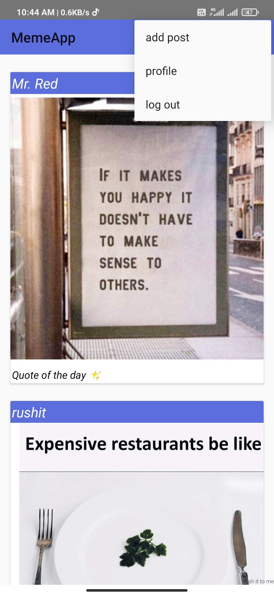
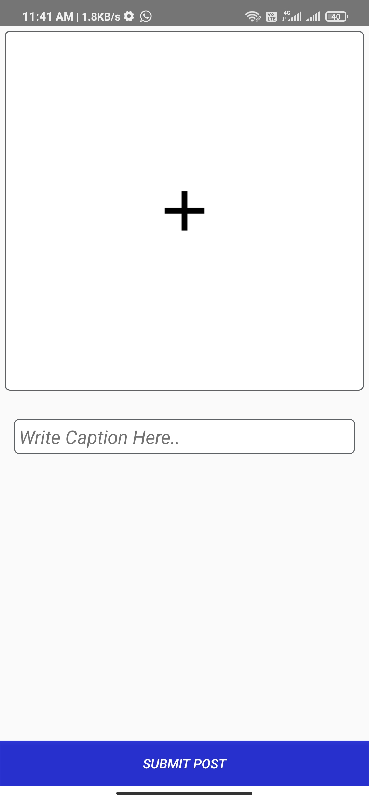
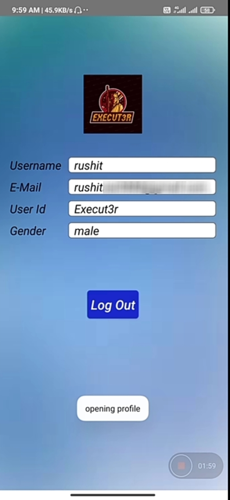

# MemeApp
Android app with Firebase

An App where users can upload a meme and all logged in users can see those images(memes) on feed.email verification for user. 
# Tech Stack
Android SDK 
Java 
Firebase (Authentication,Realtime Database,Firestore) 

# Screenshots
 
<b>Login</b>

<b>Register</b>

<b>Feed</b>

<b> post image</b>

<b> Profile</b>

